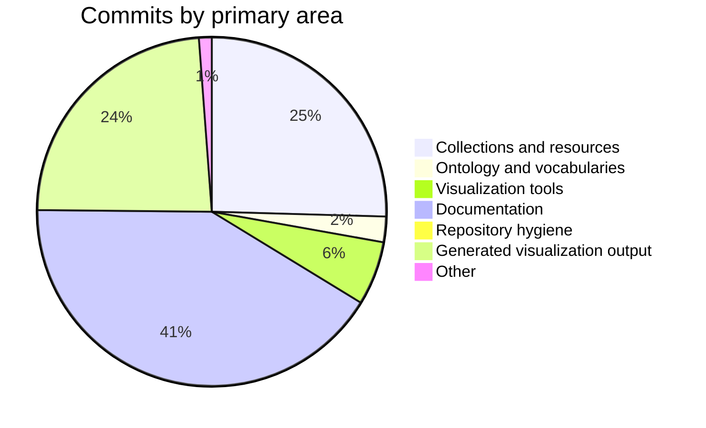

# Changelog — 2026-08-20 to 2026-09-19

Themed summary of git history on `master`. Micro-commits (repeated documentation and regenerated markmaps) are grouped; the narrative follows collections, ontology, tools, and docs.

| | |
|---|---|
| Period | 2026-08-20 → 2026-09-19 |
| Git since / until | `1 month ago` |
| Commits | 170 (65 material, 105 grouped as follow-ups) |
| Authors | Mehran Dhn (170) |
| Files touched | 414 |
| Line churn | +479,479 / −267,244 |
| Range | `0e3af26` → `7d8795a` |
| Compare | [0e3af26…7d8795a](https://github.com/MehranDHN/IIIFCollection/compare/bb4d33b82b0f148e9b2c267201cb20580c67f1e9...7d8795aa732151f8a170463dca9b467fb7d1d506) |

## Highlights

- New collection files: `KhavarannamaMetCollection.json`, `MiscUnidentifiedCollection.json`, `RamayanaV1Collection.json`, `RamayanaV2Collection.json`, `TurkishManuscriptCollection.json`.
- Catalog-wide JSON updates across 200 collection files (4 commits: “Refactoring Content type to narrower classification”, “After applying fihrist records”, “Huge Refactor”).
- Ontology / vocabulary updates touching existing Turtle sources.
- Documentation: 15 slide images added, plus other `docs/` updates.
- New visualization / tool scripts: `aat_subset_extract.py`, `generate_aat_hierarchy.py`, `generate_canvas_decomposition_markmap.py`, `generate_canvas_markmap_enhanced.py`, `generate_collection_statistics.py`, `generate_collection_tree.py`, `generate_iconography_concept_graph.py`, `generate_iconography_concept_markmap.py` (+14 more).
- Refactor small Shahnama.
- Update Data Visualization section with the new Dynamic Visualization feature/section.
- Repository cleanup: Remove obsolete SLN files.

## Activity by area

| Area | Commits |
|---|---:|
| Collections and resources | 43 |
| Ontology and vocabularies | 4 |
| Visualization tools | 10 |
| Documentation | 70 |
| Repository hygiene | 1 |
| Generated visualization output | 40 |
| Other | 2 |

## Collections and resources

New or dedicated collection work is listed first. Catalog-wide field updates (for example Fihrist enrichment) are summarised rather than repeating every JSON file.

| Collection | Status | Commits | Churn | Notes |
|---|---|---:|---|---|
| `RamayanaV1Collection.json` Ramayana V1 | New | 7 | +4,844 / −6 | Add new resources with canvas to Ramayana 1; New resource to Ramayana V1 |
| `RamayanaV2Collection.json` Ramayana V2 | New | 6 | +8,621 / −393 | Add resources to Deaprted Folio and Ramayana 1; New resources to Ramayana 2 |
| `TurkishManuscriptCollection.json` Turkish Manuscript | New | 5 | +4,026 / −13 | Enrich with Fihrist Records; Restore deleted collection |
| `MiscUnidentifiedCollection.json` Misc Unidentified | New | 2 | +1,436 / −1 | New subcollection in Persian Calligraphy |
| `KhavarannamaMetCollection.json` Khavarannama Met | New | 1 | +870 / −0 | New MET Khavarannama and its resources |
| `DepartedFolioCollection.json` Departed Folio | Dedicated | 11 | +3,103 / −13 | New MET Khavarannama and its resources; Add new resources with canvas to departed folio |
| `KufficQuranCollection.json` Kuffic Quran | Dedicated | 5 | +2,088 / −25 | New resources to Kuffic Collection; Adding new canvases to Juffic collection and introducing reference to Fihrist |
| `ZakariyaAlQazwiniCollection.json` Zakariya Al Qazwini | Dedicated | 6 | +1,160 / −425 | Enrich with Fihrist Records; Adding new canvases to Zakaria Qazvini collection |
| `PersianManuscriptCollection.json` Persian Manuscript | Dedicated | 6 | +1,144 / −229 | New Canvases; Enrich with Fihrist Records |
| `KhamseCollection.json` Khamse | Dedicated | 5 | +900 / −192 | Add new canvases to Khamse collection; Enrich with Fihrist Records |
| `MuraqqaCollection.json` Muraqqa | Dedicated | 4 | +837 / −34 | Adding new resources to Muraqqa; New Canvases to Muraqqa collection |
| `ShahnamaCollection.json` Shahnama | Dedicated | 5 | +489 / −59 | Enrich with Fihrist Records; Adding new canvases to Shahnama collection |
| `HaftOwrangIbrahimSultanCollection.json` Haft Owrang Ibrahim Sultan | Dedicated | 4 | +339 / −52 | Add new resources with canvas to Haft Orang; Refactoring and changes to resources |
| `SaadiCollection.json` Saadi | Dedicated | 4 | +178 / −17 | Enrich with Fihrist records; New Resource to Saadi collection |
| `HarvardMasjidShahPhotoCollection.json` Harvard Masjid Shah Photo | Dedicated | 3 | +1,819 / −1 | Refactoring and changes to resources; Adding new resource to Harvard Mashid Shah |
| `SmallIlkhanidShahnameCollection.json` Small Ilkhanid Shahname | Dedicated | 3 | +821 / −38 | Refactor small Shahnama |
| `ShahnameShahTahmasbCollection.json` Shahname Shah Tahmasb | Dedicated | 3 | +688 / −10 | UPdate agential info; Stop tracking OldDocs |
| `ShahnamaSupplementpersan489Collection.json` Shahnama Supplementpersan489 | Dedicated | 3 | +457 / −11 | New Canvases; UPdate agential info |

_Plus 183 further collection JSON file(s) touched only by catalog-wide or small edits._

### Collection commits

- `7d8795a` (2026-09-19) New Canvases
- `7404513` (2026-09-19) New MET Khavarannama and its resources
- `f28094b` (2026-09-18) Enrich with Fihrist records
- `100b9e0` (2026-09-18) Add new canvases to Khamse collection
- `f38ec14` (2026-09-17) Enrich with Fihrist Records
- `f8f1748` (2026-09-17) After applying fihrist records
- `1f4f492` (2026-09-16) New resources to Khamse collection
- `9ed77b7` (2026-09-16) New resources to Kuffic Collection
- `ff76ed1` (2026-09-16) Adding new canvases to Shahnama collection
- `49246ea` (2026-09-16) Adding new resources to Quran Collection
- `2f90faf` (2026-09-16) Adding new resources to Muraqqa
- `cf38e7b` (2026-09-16) Adding new canvases to Juffic collection and introducing reference to Fihrist
- `6ba342a` (2026-09-13) Adding new canvases to Zakaria Qazvini collection
- `2ffea2a` (2026-09-09) New Resource to Saadi collection
- `e3ab09c` (2026-09-09) New Canvases to Muraqqa collection
- `72cd0c5` (2026-09-09) New Resource to kuffic quran
- `5333cba` (2026-09-07) New subcollection in Persian Calligraphy
- 2 commits `d8756a4`…`d339edf` (2026-09-06 – 2026-09-07): Refactor small Shahnama
- …plus 24 further commit(s) in this area.

### New collection files

- `IIIFCollection/KhavarannamaMetCollection.json`
- `IIIFCollection/MiscUnidentifiedCollection.json`
- `IIIFCollection/RamayanaV1Collection.json`
- `IIIFCollection/RamayanaV2Collection.json`
- `IIIFCollection/TurkishManuscriptCollection.json`

## Ontology and vocabularies

| File | Commits | Churn |
|---|---:|---|
| `resources.ttl` | 1 | +9,847 / −726 |
| `iconclass_hierarchy.ttl` | 2 | +1,850 / −16 |
| `narrative_episodes.ttl` | 5 | +1,497 / −206 |
| `aat_hierarchy.ttl` | 2 | +446 / −13 |
| `PersonsRDFData.ttl` | 2 | +266 / −17 |
| `iconography_RDF.ttl` | 2 | +264 / −60 |
| `lcsh_rdf_subset.ttl` | 2 | +132 / −6 |
| `ctl_vocabs.ttl` | 2 | +28 / −0 |
| `iiifCollectionOntology.ttl` | 2 | +26 / −9 |
| `LCTGM_RDF.migrated.ttl` | 2 | +11 / −0 |

- 3 commits `3a1c112`…`53ff8e3` (2026-09-06 – 2026-09-06): Narrative Episodes.ttl
- `008ed4d` (2026-08-30) Update Contolled vocabularies and Turtle data and Ontology

## Visualization and tools

New scripts and query files:

- `IIIFCollection/tools/visualization/PROPOSAL.md`
- `IIIFCollection/tools/visualization/README.md`
- `IIIFCollection/tools/visualization/SCRIPT_GUIDE.md`
- `IIIFCollection/tools/visualization/aat_subset_extract.py`
- `IIIFCollection/tools/visualization/generate_aat_hierarchy.py`
- `IIIFCollection/tools/visualization/generate_canvas_decomposition_markmap.py`
- `IIIFCollection/tools/visualization/generate_canvas_markmap_enhanced.py`
- `IIIFCollection/tools/visualization/generate_collection_statistics.py`
- `IIIFCollection/tools/visualization/generate_collection_tree.py`
- `IIIFCollection/tools/visualization/generate_iconography_concept_graph.py`
- `IIIFCollection/tools/visualization/generate_iconography_concept_markmap.py`
- `IIIFCollection/tools/visualization/generate_persons_graph_dot.py`
- `IIIFCollection/tools/visualization/queries/aat_hierarchy.rq`
- `IIIFCollection/tools/visualization/queries/collection_membership.rq`
- `IIIFCollection/tools/visualization/queries/iconclass_hierarchy.rq`
- `IIIFCollection/tools/visualization/queries/iconography_skos.rq`
- `IIIFCollection/tools/visualization/queries/narrative_hierarchy.rq`
- `IIIFCollection/tools/visualization/queries/prefixes.rq`
- `IIIFCollection/tools/visualization/queries/query23_content_element.rq`
- `IIIFCollection/tools/visualization/queries/resource_type_stats.rq`
- …and 5 more.

- `d388192` (2026-09-04) Update Visualization tools and script
- 2 commits `1f81275`…`611936c` (2026-08-27 – 2026-08-27): Update visualization scripts and reports
- 2 commits `883145a`…`f569b0f` (2026-08-25 – 2026-08-26): Update visualization documentation
- 2 commits `473077c`…`7cf3ad9` (2026-08-25 – 2026-08-25): Update Visualization scripts and reports
- `0d4a33c` (2026-08-24) Update IIIF Documentation and other visualization scripts and report
- `3bae349` (2026-08-21) Tools and Data Visualization
- `078d86d` (2026-08-20) New tools and visualization structure

Generated markmaps / DOT / report artefacts were regenerated in 40 follow-up commit(s); they are omitted from the narrative.

## Documentation

- `IIIFCollection/images/docs/slides/` — 15 slide image(s)
- `IIIFCollection/docs/IIIF.md`
- `IIIFCollection/images/docs/Digital_Knowledge_Tree.jpg`
- `IIIFCollection/images/docs/IIIF_Digital_Heritage_Ecosystem_Guide.jpg`
- `IIIFCollection/images/docs/s1_01.jpg`
- `IIIFCollection/images/docs/s1_04.jpg`
- `IIIFCollection/images/docs/s1_06.jpg`
- `IIIFCollection/images/docs/s1_08.jpg`
- `IIIFCollection/images/docs/s1_13.jpg`

- 2 commits `4f96257`…`72546b7` (2026-09-16 – 2026-09-16): Update with draft of slides
- `5e447c3` (2026-09-16) Adding IIIF Slides
- `8174e18` (2026-09-04) Update Data Visualization section with the new Dynamic Visualization feature/section
- 2 commits `2ce7e6a`…`858c6ae` (2026-08-23 – 2026-08-23): Adding new IIIF Documentation
- `7bfa97b` (2026-08-21) Remove obsolete README files

- 63 small documentation follow-ups `590fc97`…`9b55a83` (2026-08-21 – 2026-09-17), mostly `docs/IIIF.md` and related images.

## Repository hygiene

- `c2bc6e6` (2026-08-21) Remove obsolete SLN files

## Activity snapshot

| Week | Commits |
|---|---:|
| 2026-W34 | 27 |
| 2026-W35 | 35 |
| 2026-W36 | 68 |
| 2026-W37 | 12 |
| 2026-W38 | 28 |

Busiest days:

- **2026-09-02** — 33 commits
- **2026-09-01** — 18 commits
- **2026-08-21** — 10 commits
- **2026-09-17** — 9 commits
- **2026-09-16** — 9 commits
- **2026-08-25** — 9 commits
- **2026-08-23** — 9 commits
- **2026-09-06** — 7 commits

Most frequently committed files:

| File | Commits |
|---|---:|
| `IIIFCollection/docs/IIIF.md` | 62 |
| `IIIFCollection/tools/visualization/canvas_decomposition.markmap.md` | 24 |
| `IIIFCollection/tools/visualization/iiif_decomposition_markmap_enhanced.md` | 17 |
| `IIIFCollection/tools/visualization/iconography_concept_associations.markmap.md` | 17 |
| `IIIFCollection/DepartedFolioCollection.json` | 11 |
| `IIIFCollection/RamayanaV1Collection.json` | 7 |
| `IIIFCollection/PersianManuscriptCollection.json` | 6 |
| `IIIFCollection/ZakariyaAlQazwiniCollection.json` | 6 |
| `IIIFCollection/RamayanaV2Collection.json` | 6 |
| `IIIFCollection/KhamseCollection.json` | 5 |
| `IIIFCollection/ShahnamaCollection.json` | 5 |
| `IIIFCollection/TurkishManuscriptCollection.json` | 5 |

## Commit appendix

Material commits (documentation/markmap follow-ups collapsed):

| Date | SHA | Subject |
|---|---|---|
| 2026-09-19 | `7d8795a` | New Canvases |
| 2026-09-19 | `7404513` | New MET Khavarannama and its resources |
| 2026-09-18 | `f28094b` | Enrich with Fihrist records |
| 2026-09-18 | `100b9e0` | Add new canvases to Khamse collection |
| 2026-09-17 | `f38ec14` | Enrich with Fihrist Records |
| 2026-09-17 | `f8f1748` | After applying fihrist records † |
| 2026-09-17 | `375787c` | After applying fihrist records |
| 2026-09-16 | `1f4f492` | New resources to Khamse collection |
| 2026-09-16 | `9ed77b7` | New resources to Kuffic Collection |
| 2026-09-16 | `72546b7` | Update with draft of slides |
| 2026-09-16 | `4f96257` | Update with draft of slides |
| 2026-09-16 | `5e447c3` | Adding IIIF Slides |
| 2026-09-16 | `ff76ed1` | Adding new canvases to Shahnama collection |
| 2026-09-16 | `49246ea` | Adding new resources to Quran Collection |
| 2026-09-16 | `2f90faf` | Adding new resources to Muraqqa |
| 2026-09-16 | `cf38e7b` | Adding new canvases to Juffic collection and introducing reference to Fihrist |
| 2026-09-13 | `6ba342a` | Adding new canvases to Zakaria Qazvini collection |
| 2026-09-09 | `2ffea2a` | New Resource to Saadi collection |
| 2026-09-09 | `e3ab09c` | New Canvases to Muraqqa collection |
| 2026-09-09 | `72cd0c5` | New Resource to kuffic quran |
| 2026-09-07 | `5333cba` | New subcollection in Persian Calligraphy |
| 2026-09-07 | `d339edf` | Refactor small Shahnama |
| 2026-09-06 | `d8756a4` | Refactor small Shahnama |
| 2026-09-06 | `53ff8e3` | Narrative Episodes.ttl |
| 2026-09-06 | `8f6fa32` | Narrative Episodes.ttl |
| 2026-09-06 | `3a1c112` | Narrative Episodes.ttl |
| 2026-09-05 | `7efaece` | UPdate agential info |
| 2026-09-05 | `8e0bf03` | UPdate agential info |
| 2026-09-05 | `37e7c96` | UPdate agential info |
| 2026-09-05 | `ccdf7fb` | UPdate agential info, Some AAT terms and new resources |
| 2026-09-04 | `8174e18` | Update Data Visualization section with the new Dynamic Visualization feature/section |
| 2026-09-04 | `d388192` | Update Visualization tools and script |
| 2026-09-01 | `3a55d9b` | Huge Refactor † |
| 2026-08-31 | `7ac1641` | Refactoring Content type to narrower classification † |
| 2026-08-31 | `ca73810` | Refactoring Content type to narrower classification † |
| 2026-08-30 | `008ed4d` | Update Contolled vocabularies and Turtle data and Ontology |
| 2026-08-29 | `779cc26` | Restore deleted collection |
| 2026-08-29 | `74a5977` | Add new resources with canvas to Ramayana 1 |
| 2026-08-29 | `ce03d21` | Add new resources with canvas to Haft Orang |
| 2026-08-29 | `54f9ef2` | Add new resources with canvas to departed folio |
| 2026-08-27 | `611936c` | Update visualization scripts and reports |
| 2026-08-27 | `1f81275` | Update visualization scripts and reports |
| 2026-08-26 | `ba72897` | New resource to Ramayana V1 |
| 2026-08-26 | `f569b0f` | Update visualization documentation |
| 2026-08-25 | `883145a` | Update visualization documentation |
| 2026-08-25 | `2e9224d` | Add resources to Deaprted Folio and Ramayana 1 |
| 2026-08-25 | `395908a` | New resources to Ramayana 1 |
| 2026-08-25 | `5316ab9` | New SubCollection Ramayana Vol1 and its resources |
| 2026-08-25 | `b8d6849` | New resources to Ramayana 2 |
| 2026-08-25 | `7cf3ad9` | Update Visualization scripts and reports |
| 2026-08-25 | `473077c` | Update Visualization scripts and reports |
| 2026-08-24 | `241bcbf` | New Ramayana resources |
| 2026-08-24 | `4e11659` | New Ramaya Subcollection and its resources |
| 2026-08-24 | `53c92dd` | Refactoring and changes to resources |
| 2026-08-23 | `858c6ae` | Adding new IIIF Documentation |
| 2026-08-23 | `2ce7e6a` | Adding new IIIF Documentation |
| 2026-08-23 | `225d7c3` | Adding new resource to Harvard Mashid Shah |
| 2026-08-23 | `2b75a90` | Adding new resource to Departed Collection |
| 2026-08-22 | `f9ebfa8` | Adding new resource to Departed Collection |
| 2026-08-22 | `e9f6319` | Adding new resource to sarre collection |
| 2026-08-21 | `c2bc6e6` | Remove obsolete SLN files |
| 2026-08-21 | `7bfa97b` | Remove obsolete README files |
| 2026-08-21 | `0f1fea6` | Stop tracking OldDocs |
| 2026-08-21 | `3bae349` | Tools and Data Visualization |
| 2026-08-20 | `078d86d` | New tools and visualization structure |

† Catalog-wide collection JSON update.

All 170 commits

| Date | SHA | Subject |
|---|---|---|
| 2026-09-19 | `7d8795a` | New Canvases |
| 2026-09-19 | `7404513` | New MET Khavarannama and its resources |
| 2026-09-18 | `08a19c3` | Update visualization markup |
| 2026-09-18 | `fbd6e79` | Update visualization markup |
| 2026-09-18 | `f28094b` | Enrich with Fihrist records |
| 2026-09-18 | `100b9e0` | Add new canvases to Khamse collection |
| 2026-09-18 | `6259780` | Update visualization markup |
| 2026-09-17 | `f38ec14` | Enrich with Fihrist Records |
| 2026-09-17 | `e08dfcf` | Update canvas decomposition markmap |
| 2026-09-17 | `47d644d` | Update canvas decomposition markmap |
| 2026-09-17 | `b14c329` | Update canvas decomposition markmap |
| 2026-09-17 | `9b55a83` | Update IIIF.md with description of Slide01 |
| 2026-09-17 | `8221885` | Update IIIF.md with description of Slide01 |
| 2026-09-17 | `70dff35` | Update canvas decomposition markmap |
| 2026-09-17 | `f8f1748` | After applying fihrist records |
| 2026-09-17 | `375787c` | After applying fihrist records |
| 2026-09-16 | `1f4f492` | New resources to Khamse collection |
| 2026-09-16 | `9ed77b7` | New resources to Kuffic Collection |
| 2026-09-16 | `72546b7` | Update with draft of slides |
| 2026-09-16 | `4f96257` | Update with draft of slides |
| 2026-09-16 | `5e447c3` | Adding IIIF Slides |
| 2026-09-16 | `ff76ed1` | Adding new canvases to Shahnama collection |
| 2026-09-16 | `49246ea` | Adding new resources to Quran Collection |
| 2026-09-16 | `2f90faf` | Adding new resources to Muraqqa |
| 2026-09-16 | `cf38e7b` | Adding new canvases to Juffic collection and introducing reference to Fihrist |
| 2026-09-14 | `ba16aac` | Update IIIF.md |
| 2026-09-14 | `6796c40` | Update IIIF.md with two new slide |
| 2026-09-14 | `10918f5` | Update IIIF.md |
| 2026-09-13 | `b46b434` | Update markmap decomposition |
| 2026-09-13 | `3e5bfab` | Update markmap decomposition |
| 2026-09-13 | `280b9e7` | Update markmap decomposition |
| 2026-09-13 | `50cb414` | Update markmap decomposition |
| 2026-09-13 | `6ba342a` | Adding new canvases to Zakaria Qazvini collection |
| 2026-09-11 | `b3377e3` | Update visualization markmap |
| 2026-09-11 | `93281e8` | Update visualization markmap |
| 2026-09-09 | `2ffea2a` | New Resource to Saadi collection |
| 2026-09-09 | `e3ab09c` | New Canvases to Muraqqa collection |
| 2026-09-09 | `72cd0c5` | New Resource to kuffic quran |
| 2026-09-07 | `5333cba` | New subcollection in Persian Calligraphy |
| 2026-09-07 | `d339edf` | Refactor small Shahnama |
| 2026-09-06 | `d8756a4` | Refactor small Shahnama |
| 2026-09-06 | `c59f089` | Update output of visualization reports |
| 2026-09-06 | `53ff8e3` | Narrative Episodes.ttl |
| 2026-09-06 | `8f6fa32` | Narrative Episodes.ttl |
| 2026-09-06 | `3a1c112` | Narrative Episodes.ttl |
| 2026-09-06 | `e9c0b01` | Update readme |
| 2026-09-06 | `7142841` | Update canvas decomposition markmap |
| 2026-09-05 | `7efaece` | UPdate agential info |
| 2026-09-05 | `8e0bf03` | UPdate agential info |
| 2026-09-05 | `37e7c96` | UPdate agential info |
| 2026-09-05 | `ccdf7fb` | UPdate agential info, Some AAT terms and new resources |
| 2026-09-04 | `b5507e5` | Fix syntax error |
| 2026-09-04 | `8174e18` | Update Data Visualization section with the new Dynamic Visualization feature/section |
| 2026-09-04 | `d388192` | Update Visualization tools and script |
| 2026-09-02 | `6eb59d4` | Update markmap visualization |
| 2026-09-02 | `472404c` | Updating IIIF.md |
| 2026-09-02 | `fa4e451` | Updating IIIF.md |
| 2026-09-02 | `002aa27` | Updating IIIF.md |
| 2026-09-02 | `6ca2b5d` | Updating IIIF.md |
| 2026-09-02 | `e15c50e` | Updating IIIF.md |
| 2026-09-02 | `3f92d2f` | Updating IIIF.md |
| 2026-09-02 | `b22abd4` | Updating IIIF.md |
| 2026-09-02 | `4b8d354` | Updating IIIF.md |
| 2026-09-02 | `568f9f6` | Updating IIIF.md |
| 2026-09-02 | `d598514` | Updating IIIF.md |
| 2026-09-02 | `fa2f175` | Updating IIIF.md |
| 2026-09-02 | `68e42b6` | Updating IIIF.md |
| 2026-09-02 | `3f04ac6` | Updating IIIF.md |
| 2026-09-02 | `21c4799` | Updating IIIF.md |
| 2026-09-02 | `f1b8316` | Updating IIIF.md |
| 2026-09-02 | `046cc44` | Updating IIIF.md |
| 2026-09-02 | `b35e41f` | Updating IIIF.md |
| 2026-09-02 | `4d51713` | Updating IIIF.md |
| 2026-09-02 | `09d95b2` | Updating IIIF.md |
| 2026-09-02 | `ce00869` | Updating IIIF.md |
| 2026-09-02 | `183bc07` | Updating IIIF.md |
| 2026-09-02 | `bf14fcc` | Updating IIIF.md |
| 2026-09-02 | `1104a9f` | Updating IIIF.md |
| 2026-09-02 | `1e0d7e4` | Updating IIIF.md |
| 2026-09-02 | `6020d21` | Updating IIIF.md |
| 2026-09-02 | `a991931` | Updating IIIF.md |
| 2026-09-02 | `2373990` | Updating IIIF.md |
| 2026-09-02 | `6633731` | Updating IIIF.md |
| 2026-09-02 | `4e4dcab` | Updating IIIF.md |
| 2026-09-02 | `91d8041` | Updating IIIF.md |
| 2026-09-02 | `b71048c` | Updating IIIF.md |
| 2026-09-02 | `d2a68fb` | Updating IIIF.md |
| 2026-09-01 | `08ae477` | Updating IIIF.md |
| 2026-09-01 | `c7081be` | Updating IIIF.md |
| 2026-09-01 | `5726429` | Updating IIIF.md |
| 2026-09-01 | `bfe24c8` | Updating IIIF.md |
| 2026-09-01 | `9fd3377` | Updating IIIF.md |
| 2026-09-01 | `234b624` | Updating IIIF.md |
| 2026-09-01 | `89daf39` | Updating IIIF.md |
| 2026-09-01 | `4cb5830` | Updating IIIF.md |
| 2026-09-01 | `0f201ae` | Updating IIIF.md |
| 2026-09-01 | `282b9b4` | Updating IIIF.md |
| 2026-09-01 | `c6fa0c0` | Updating IIIF.md |
| 2026-09-01 | `1c2b1bd` | Updating IIIF.md |
| 2026-09-01 | `e78497d` | Updating IIIF.md |
| 2026-09-01 | `eaaad26` | Updating IIIF document image |
| 2026-09-01 | `917acab` | Updating IIIF.md |
| 2026-09-01 | `b98c570` | Updating IIIF.md |
| 2026-09-01 | `cbbd70a` | Updating visualization reports |
| 2026-09-01 | `3a55d9b` | Huge Refactor |
| 2026-08-31 | `378b06f` | Update iconography markmap |
| 2026-08-31 | `7ac1641` | Refactoring Content type to narrower classification |
| 2026-08-31 | `ca73810` | Refactoring Content type to narrower classification |
| 2026-08-30 | `008ed4d` | Update Contolled vocabularies and Turtle data and Ontology |
| 2026-08-30 | `8e01650` | Update markmap visualization |
| 2026-08-29 | `779cc26` | Restore deleted collection |
| 2026-08-29 | `b51351e` | Update visualization markmap |
| 2026-08-29 | `74a5977` | Add new resources with canvas to Ramayana 1 |
| 2026-08-29 | `ce03d21` | Add new resources with canvas to Haft Orang |
| 2026-08-29 | `54f9ef2` | Add new resources with canvas to departed folio |
| 2026-08-29 | `9f3cc63` | Update IIIF.md changes |
| 2026-08-29 | `faaf672` | Update IIIF.md changes |
| 2026-08-27 | `55a7c51` | Update visualization scripts and reports |
| 2026-08-27 | `04a874e` | Update visualization scripts and reports |
| 2026-08-27 | `8f6b0e7` | Update visualization scripts and reports |
| 2026-08-27 | `0aa28e4` | Update visualization scripts and reports |
| 2026-08-27 | `611936c` | Update visualization scripts and reports |
| 2026-08-27 | `1f81275` | Update visualization scripts and reports |
| 2026-08-27 | `49848f6` | Update visualization scripts and reports |
| 2026-08-26 | `ba72897` | New resource to Ramayana V1 |
| 2026-08-26 | `f569b0f` | Update visualization documentation |
| 2026-08-26 | `0bd4c5a` | Update visualization documentation |
| 2026-08-26 | `e6dbfaf` | Update visualization documentation |
| 2026-08-25 | `883145a` | Update visualization documentation |
| 2026-08-25 | `2e9224d` | Add resources to Deaprted Folio and Ramayana 1 |
| 2026-08-25 | `312840f` | Update Visualization scripts and reports |
| 2026-08-25 | `395908a` | New resources to Ramayana 1 |
| 2026-08-25 | `5316ab9` | New SubCollection Ramayana Vol1 and its resources |
| 2026-08-25 | `b8d6849` | New resources to Ramayana 2 |
| 2026-08-25 | `a546405` | Update Visualization scripts and reports |
| 2026-08-25 | `7cf3ad9` | Update Visualization scripts and reports |
| 2026-08-25 | `473077c` | Update Visualization scripts and reports |
| 2026-08-24 | `241bcbf` | New Ramayana resources |
| 2026-08-24 | `4e11659` | New Ramaya Subcollection and its resources |
| 2026-08-24 | `53c92dd` | Refactoring and changes to resources |
| 2026-08-24 | `0d4a33c` | Update IIIF Documentation and other visualization scripts and report |
| 2026-08-24 | `e0cc73b` | Update IIIF Documentation |
| 2026-08-24 | `1a7f263` | Update IIIF Documentation |
| 2026-08-23 | `38a67e0` | Update IIIF Documentation |
| 2026-08-23 | `f8ed105` | Update IIIF Documentation |
| 2026-08-23 | `6d0d182` | Update IIIF Documentation |
| 2026-08-23 | `51137ee` | Update IIIF Documentation |
| 2026-08-23 | `de6ee8c` | Update IIIF Documentation |
| 2026-08-23 | `858c6ae` | Adding new IIIF Documentation |
| 2026-08-23 | `2ce7e6a` | Adding new IIIF Documentation |
| 2026-08-23 | `225d7c3` | Adding new resource to Harvard Mashid Shah |
| 2026-08-23 | `2b75a90` | Adding new resource to Departed Collection |
| 2026-08-22 | `f9ebfa8` | Adding new resource to Departed Collection |
| 2026-08-22 | `e9f6319` | Adding new resource to sarre collection |
| 2026-08-21 | `c2bc6e6` | Remove obsolete SLN files |
| 2026-08-21 | `7bfa97b` | Remove obsolete README files |
| 2026-08-21 | `0f1fea6` | Stop tracking OldDocs |
| 2026-08-21 | `3bae349` | Tools and Data Visualization |
| 2026-08-21 | `590fc97` | Update README.md |
| 2026-08-21 | `5204253` | Update decomposition markmap |
| 2026-08-21 | `d1bae8a` | Update decomposition markmap |
| 2026-08-21 | `b575965` | Update decomposition markmap |
| 2026-08-21 | `b98e75c` | Update decomposition markmap |
| 2026-08-21 | `16231c0` | Update decomposition markmap |
| 2026-08-20 | `7b7ce9d` | Update decomposition markmap |
| 2026-08-20 | `a488c5f` | Update decomposition markmap |
| 2026-08-20 | `b6209c3` | Update decomposition markmap |
| 2026-08-20 | `bcd86b1` | Update decomposition markmap |
| 2026-08-20 | `078d86d` | New tools and visualization structure |
| 2026-08-20 | `0e3af26` | Update decomposition markmap |

---

_Generated 2026-09-19 14:44 +0330 by `IIIFCollection/tools/generate_changelog.py`. Command: `python IIIFCollection/tools/generate_changelog.py --since "1 month ago"`._
