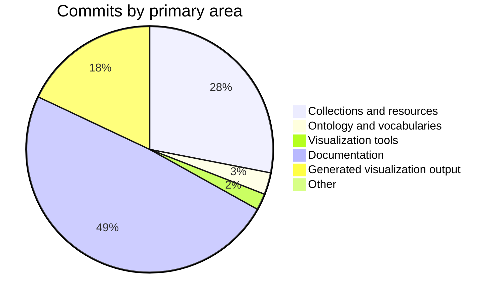

# Changelog — 2026-08-27 to 2026-09-27

Themed summary of git history on `master`. Micro-commits (repeated documentation and regenerated markmaps) are grouped; the narrative follows collections, ontology, tools, and docs.

| | |
|---|---|
| Period | 2026-08-27 → 2026-09-27 |
| Git since / until | `1 month ago` |
| Commits | 140 (53 material, 87 grouped as follow-ups) |
| Authors | Mehran Dhn (140) |
| Files touched | 318 |
| Line churn | +413,521 / −104,002 |
| Range | `1f81275` → `8d6ad1f` |
| Compare | [1f81275…8d6ad1f](https://github.com/MehranDHN/IIIFCollection/compare/49848f6e7bc2376d87721b311b456b7e7398dc4f...8d6ad1fe111f4fa602d839302add9e10943621e7) |

## Highlights

- New collection files: `KhavarannamaMetCollection.json`, `MiscUnidentifiedCollection.json`, `TurkishManuscriptCollection.json`.
- Catalog-wide JSON updates across 200 collection files (4 commits: “Refactoring Content type to narrower classification”, “After applying fihrist records”, “Huge Refactor”).
- Ontology / vocabulary updates touching existing Turtle sources.
- Documentation: 15 slide images added, plus other `docs/` updates.
- New visualization / tool scripts: `aat_hierarchy.rq`, `collection_membership.rq`, `iconclass_hierarchy.rq`, `iconography_skos.rq`, `narrative_hierarchy.rq`, `prefixes.rq`, `query23_content_element.rq`, `resource_type_stats.rq` (+4 more).
- Refactoring Narrative source.
- Refactor small Shahnama.
- Refactoring Narrative structure of the Shahnama shah tahmasb and new resource to Shahnama collection.

## Activity by area

| Area | Commits |
|---|---:|
| Collections and resources | 39 |
| Ontology and vocabularies | 4 |
| Visualization tools | 3 |
| Documentation | 68 |
| Generated visualization output | 25 |
| Other | 1 |

## Collections and resources

New or dedicated collection work is listed first. Catalog-wide field updates (for example Fihrist enrichment) are summarised rather than repeating every JSON file.

| Collection | Status | Commits | Churn | Notes |
|---|---|---:|---|---|
| `TurkishManuscriptCollection.json` Turkish Manuscript | New | 5 | +4,026 / −13 | Enrich with Fihrist Records; Restore deleted collection |
| `MiscUnidentifiedCollection.json` Misc Unidentified | New | 2 | +1,436 / −1 | New subcollection in Persian Calligraphy |
| `KhavarannamaMetCollection.json` Khavarannama Met | New | 1 | +870 / −0 | New MET Khavarannama and its resources |
| `PersianManuscriptCollection.json` Persian Manuscript | Dedicated | 8 | +1,174 / −240 | Refactoring Narrative source; Refactoring Fihrist record and some new recordes to single photo and single sheet |
| `KhamseCollection.json` Khamse | Dedicated | 6 | +904 / −196 | Refactoring Fihrist record and some new recordes to single photo and single sheet; Add new canvases to Khamse collection |
| `KufficQuranCollection.json` Kuffic Quran | Dedicated | 5 | +2,088 / −25 | New resources to Kuffic Collection; Adding new canvases to Juffic collection and introducing reference to Fihrist |
| `ZakariyaAlQazwiniCollection.json` Zakariya Al Qazwini | Dedicated | 6 | +1,160 / −425 | Enrich with Fihrist Records; Adding new canvases to Zakaria Qazvini collection |
| `ShahnamaCollection.json` Shahnama | Dedicated | 6 | +965 / −60 | Refactoring Narrative structure of the Shahnama shah tahmasb and new resource to Shahnama collection; Enrich with Fihrist Records |
| `MuraqqaCollection.json` Muraqqa | Dedicated | 5 | +847 / −34 | Refactoring Narrative source; Adding new resources to Muraqqa |
| `SaadiCollection.json` Saadi | Dedicated | 5 | +291 / −18 | Refactoring Narrative source; Enrich with Fihrist records |
| `DepartedFolioCollection.json` Departed Folio | Dedicated | 6 | +1,971 / −10 | Refactoring Narrative source; New MET Khavarannama and its resources |
| `SmallIlkhanidShahnameCollection.json` Small Ilkhanid Shahname | Dedicated | 4 | +898 / −39 | Refactoring Narrative structure of the Shahnama shah tahmasb and new resource to Shahnama collection; Refactor small Shahnama |
| `ShahnameShahTahmasbCollection.json` Shahname Shah Tahmasb | Dedicated | 3 | +880 / −21 | Refactoring Narrative structure of the Shahnama shah tahmasb and new resource to Shahnama collection; UPdate agential info |
| `ShahnamaSupplementpersan489Collection.json` Shahnama Supplementpersan489 | Dedicated | 3 | +457 / −11 | New Canvases; UPdate agential info |
| `KulliatSaadiCollection.json` Kulliat Saadi | Dedicated | 3 | +316 / −46 | Refactoring Narrative source; UPdate agential info |
| `SinglePhotoCollection.json` Single Photo | Dedicated | 3 | +239 / −46 | Fix Agential mistake; Refactoring Fihrist record and some new recordes to single photo and single sheet |
| `MayronBementSmithCollection.json` Mayron Bement Smith | Dedicated | 4 | +141 / −3 | Refactoring; New photograph to Bement Smith Collection |
| `ShahnamaMsorfol4251Collection.json` Shahnama Msorfol4251 | Dedicated | 3 | +120 / −2 | UPdate agential info; UPdate agential info, Some AAT terms and new resources |

_Plus 183 further collection JSON file(s) touched only by catalog-wide or small edits._

### Collection commits

- `8d6ad1f` (2026-09-27) Refactoring Narrative structure of the Shahnama shah tahmasb and new resource to Shahnama collection
- 2 commits `fd59b78`…`ec6b8c7` (2026-09-25 – 2026-09-25): Refactoring Narrative source
- `760058b` (2026-09-25) Refactoring
- `01df184` (2026-09-25) New resource to Mir Emad Collection
- `096ce13` (2026-09-24) Fix Agential mistake
- `c5ab71f` (2026-09-24) New photograph to Bement Smith Collection
- `ac060d7` (2026-09-21) Refactoring Fihrist record and some new recordes to single photo and single sheet
- `6be9d22` (2026-09-21) Refactoring Fihrist record
- `7d8795a` (2026-09-19) New Canvases
- `7404513` (2026-09-19) New MET Khavarannama and its resources
- `f28094b` (2026-09-18) Enrich with Fihrist records
- `100b9e0` (2026-09-18) Add new canvases to Khamse collection
- `f38ec14` (2026-09-17) Enrich with Fihrist Records
- `f8f1748` (2026-09-17) After applying fihrist records
- `1f4f492` (2026-09-16) New resources to Khamse collection
- `9ed77b7` (2026-09-16) New resources to Kuffic Collection
- `ff76ed1` (2026-09-16) Adding new canvases to Shahnama collection
- `49246ea` (2026-09-16) Adding new resources to Quran Collection
- …plus 20 further commit(s) in this area.

### New collection files

- `IIIFCollection/KhavarannamaMetCollection.json`
- `IIIFCollection/MiscUnidentifiedCollection.json`
- `IIIFCollection/TurkishManuscriptCollection.json`

## Ontology and vocabularies

| File | Commits | Churn |
|---|---:|---|
| `resources.ttl` | 1 | +9,847 / −726 |
| `narrative_episodes.ttl` | 4 | +1,271 / −165 |
| `iconclass_hierarchy.ttl` | 1 | +1,263 / −1 |
| `aat_hierarchy.ttl` | 1 | +187 / −1 |
| `PersonsRDFData.ttl` | 1 | +163 / −2 |
| `iconography_RDF.ttl` | 1 | +77 / −30 |
| `lcsh_rdf_subset.ttl` | 1 | +58 / −4 |
| `iiifCollectionOntology.ttl` | 1 | +25 / −9 |
| `ctl_vocabs.ttl` | 1 | +17 / −0 |
| `LCTGM_RDF.migrated.ttl` | 1 | +7 / −0 |

- 3 commits `3a1c112`…`53ff8e3` (2026-09-06 – 2026-09-06): Narrative Episodes.ttl
- `008ed4d` (2026-08-30) Update Contolled vocabularies and Turtle data and Ontology

## Visualization and tools

New scripts and query files:

- `IIIFCollection/tools/visualization/queries/aat_hierarchy.rq`
- `IIIFCollection/tools/visualization/queries/collection_membership.rq`
- `IIIFCollection/tools/visualization/queries/iconclass_hierarchy.rq`
- `IIIFCollection/tools/visualization/queries/iconography_skos.rq`
- `IIIFCollection/tools/visualization/queries/narrative_hierarchy.rq`
- `IIIFCollection/tools/visualization/queries/prefixes.rq`
- `IIIFCollection/tools/visualization/queries/query23_content_element.rq`
- `IIIFCollection/tools/visualization/queries/resource_type_stats.rq`
- `IIIFCollection/tools/visualization/queries/tgm_hierarchy.rq`
- `IIIFCollection/tools/visualization/query_runner.py`
- `IIIFCollection/tools/visualization/render_query_graph.py`
- `IIIFCollection/tools/visualization/viz_common.py`

- `d388192` (2026-09-04) Update Visualization tools and script
- 2 commits `1f81275`…`611936c` (2026-08-27 – 2026-08-27): Update visualization scripts and reports

Generated markmaps / DOT / report artefacts were regenerated in 25 follow-up commit(s); they are omitted from the narrative.

## Documentation

- `IIIFCollection/images/docs/slides/` — 15 slide image(s)
- `IIIFCollection/docs/changelog_2026-08-20_2026-09-19.md`
- `IIIFCollection/images/docs/Digital_Knowledge_Tree.jpg`
- `IIIFCollection/images/docs/IIIF_Digital_Heritage_Ecosystem_Guide.jpg`
- `IIIFCollection/images/docs/s1_01.jpg`
- `IIIFCollection/images/docs/s1_04.jpg`
- `IIIFCollection/images/docs/s1_06.jpg`
- `IIIFCollection/images/docs/s1_08.jpg`
- `IIIFCollection/images/docs/s1_13.jpg`

- `469cb98` (2026-09-23) Update with new description about slides
- `1242994` (2026-09-19) First Changelog report in markdown format
- 2 commits `4f96257`…`72546b7` (2026-09-16 – 2026-09-16): Update with draft of slides
- `5e447c3` (2026-09-16) Adding IIIF Slides
- `8174e18` (2026-09-04) Update Data Visualization section with the new Dynamic Visualization feature/section

- 62 small documentation follow-ups `faaf672`…`2e70ff2` (2026-08-29 – 2026-09-23), mostly `docs/IIIF.md` and related images.

## Activity snapshot

| Week | Commits |
|---|---:|
| 2026-W35 | 15 |
| 2026-W36 | 68 |
| 2026-W37 | 12 |
| 2026-W38 | 29 |
| 2026-W39 | 16 |

Busiest days:

- **2026-09-02** — 33 commits
- **2026-09-01** — 18 commits
- **2026-09-17** — 9 commits
- **2026-09-16** — 9 commits
- **2026-09-06** — 7 commits
- **2026-08-29** — 7 commits
- **2026-09-23** — 6 commits
- **2026-08-27** — 6 commits

Most frequently committed files:

| File | Commits |
|---|---:|
| `IIIFCollection/docs/IIIF.md` | 61 |
| `IIIFCollection/tools/visualization/canvas_decomposition.markmap.md` | 19 |
| `IIIFCollection/tools/visualization/iconography_concept_associations.markmap.md` | 9 |
| `IIIFCollection/PersianManuscriptCollection.json` | 8 |
| `IIIFCollection/ShahnamaCollection.json` | 6 |
| `IIIFCollection/DepartedFolioCollection.json` | 6 |
| `IIIFCollection/KhamseCollection.json` | 6 |
| `IIIFCollection/ZakariyaAlQazwiniCollection.json` | 6 |
| `IIIFCollection/MuraqqaCollection.json` | 5 |
| `IIIFCollection/SaadiCollection.json` | 5 |
| `IIIFCollection/tools/visualization/iiif_decomposition_markmap_enhanced.md` | 5 |
| `IIIFCollection/TurkishManuscriptCollection.json` | 5 |

## Commit appendix

Material commits (documentation/markmap follow-ups collapsed):

| Date | SHA | Subject |
|---|---|---|
| 2026-09-27 | `8d6ad1f` | Refactoring Narrative structure of the Shahnama shah tahmasb and new resource to Shahnama collection |
| 2026-09-25 | `ec6b8c7` | Refactoring Narrative source |
| 2026-09-25 | `fd59b78` | Refactoring Narrative source |
| 2026-09-25 | `760058b` | Refactoring |
| 2026-09-25 | `01df184` | New resource to Mir Emad Collection |
| 2026-09-24 | `096ce13` | Fix Agential mistake |
| 2026-09-24 | `c5ab71f` | New photograph to Bement Smith Collection |
| 2026-09-23 | `469cb98` | Update with new description about slides |
| 2026-09-21 | `ac060d7` | Refactoring Fihrist record and some new recordes to single photo and single sheet |
| 2026-09-21 | `6be9d22` | Refactoring Fihrist record |
| 2026-09-19 | `1242994` | First Changelog report in markdown format |
| 2026-09-19 | `7d8795a` | New Canvases |
| 2026-09-19 | `7404513` | New MET Khavarannama and its resources |
| 2026-09-18 | `f28094b` | Enrich with Fihrist records |
| 2026-09-18 | `100b9e0` | Add new canvases to Khamse collection |
| 2026-09-17 | `f38ec14` | Enrich with Fihrist Records |
| 2026-09-17 | `f8f1748` | After applying fihrist records † |
| 2026-09-17 | `375787c` | After applying fihrist records |
| 2026-09-16 | `1f4f492` | New resources to Khamse collection |
| 2026-09-16 | `9ed77b7` | New resources to Kuffic Collection |
| 2026-09-16 | `72546b7` | Update with draft of slides |
| 2026-09-16 | `4f96257` | Update with draft of slides |
| 2026-09-16 | `5e447c3` | Adding IIIF Slides |
| 2026-09-16 | `ff76ed1` | Adding new canvases to Shahnama collection |
| 2026-09-16 | `49246ea` | Adding new resources to Quran Collection |
| 2026-09-16 | `2f90faf` | Adding new resources to Muraqqa |
| 2026-09-16 | `cf38e7b` | Adding new canvases to Juffic collection and introducing reference to Fihrist |
| 2026-09-13 | `6ba342a` | Adding new canvases to Zakaria Qazvini collection |
| 2026-09-09 | `2ffea2a` | New Resource to Saadi collection |
| 2026-09-09 | `e3ab09c` | New Canvases to Muraqqa collection |
| 2026-09-09 | `72cd0c5` | New Resource to kuffic quran |
| 2026-09-07 | `5333cba` | New subcollection in Persian Calligraphy |
| 2026-09-07 | `d339edf` | Refactor small Shahnama |
| 2026-09-06 | `d8756a4` | Refactor small Shahnama |
| 2026-09-06 | `53ff8e3` | Narrative Episodes.ttl |
| 2026-09-06 | `8f6fa32` | Narrative Episodes.ttl |
| 2026-09-06 | `3a1c112` | Narrative Episodes.ttl |
| 2026-09-05 | `7efaece` | UPdate agential info |
| 2026-09-05 | `8e0bf03` | UPdate agential info |
| 2026-09-05 | `37e7c96` | UPdate agential info |
| 2026-09-05 | `ccdf7fb` | UPdate agential info, Some AAT terms and new resources |
| 2026-09-04 | `8174e18` | Update Data Visualization section with the new Dynamic Visualization feature/section |
| 2026-09-04 | `d388192` | Update Visualization tools and script |
| 2026-09-01 | `3a55d9b` | Huge Refactor † |
| 2026-08-31 | `7ac1641` | Refactoring Content type to narrower classification † |
| 2026-08-31 | `ca73810` | Refactoring Content type to narrower classification † |
| 2026-08-30 | `008ed4d` | Update Contolled vocabularies and Turtle data and Ontology |
| 2026-08-29 | `779cc26` | Restore deleted collection |
| 2026-08-29 | `74a5977` | Add new resources with canvas to Ramayana 1 |
| 2026-08-29 | `ce03d21` | Add new resources with canvas to Haft Orang |
| 2026-08-29 | `54f9ef2` | Add new resources with canvas to departed folio |
| 2026-08-27 | `611936c` | Update visualization scripts and reports |
| 2026-08-27 | `1f81275` | Update visualization scripts and reports |

† Catalog-wide collection JSON update.

All 140 commits

| Date | SHA | Subject |
|---|---|---|
| 2026-09-27 | `8d6ad1f` | Refactoring Narrative structure of the Shahnama shah tahmasb and new resource to Shahnama collection |
| 2026-09-26 | `825ecee` | Add narrative visualization sample report |
| 2026-09-25 | `ec6b8c7` | Refactoring Narrative source |
| 2026-09-25 | `fd59b78` | Refactoring Narrative source |
| 2026-09-25 | `760058b` | Refactoring |
| 2026-09-25 | `01df184` | New resource to Mir Emad Collection |
| 2026-09-24 | `096ce13` | Fix Agential mistake |
| 2026-09-24 | `c5ab71f` | New photograph to Bement Smith Collection |
| 2026-09-23 | `2e70ff2` | Update with new description about slides |
| 2026-09-23 | `8945e44` | Update with new description about slides |
| 2026-09-23 | `15fa83e` | Update with new description about slides |
| 2026-09-23 | `8e8d03e` | Update with new description about slides |
| 2026-09-23 | `158c218` | Update with new description about slides |
| 2026-09-23 | `469cb98` | Update with new description about slides |
| 2026-09-21 | `ac060d7` | Refactoring Fihrist record and some new recordes to single photo and single sheet |
| 2026-09-21 | `6be9d22` | Refactoring Fihrist record |
| 2026-09-19 | `1242994` | First Changelog report in markdown format |
| 2026-09-19 | `7d8795a` | New Canvases |
| 2026-09-19 | `7404513` | New MET Khavarannama and its resources |
| 2026-09-18 | `08a19c3` | Update visualization markup |
| 2026-09-18 | `fbd6e79` | Update visualization markup |
| 2026-09-18 | `f28094b` | Enrich with Fihrist records |
| 2026-09-18 | `100b9e0` | Add new canvases to Khamse collection |
| 2026-09-18 | `6259780` | Update visualization markup |
| 2026-09-17 | `f38ec14` | Enrich with Fihrist Records |
| 2026-09-17 | `e08dfcf` | Update canvas decomposition markmap |
| 2026-09-17 | `47d644d` | Update canvas decomposition markmap |
| 2026-09-17 | `b14c329` | Update canvas decomposition markmap |
| 2026-09-17 | `9b55a83` | Update IIIF.md with description of Slide01 |
| 2026-09-17 | `8221885` | Update IIIF.md with description of Slide01 |
| 2026-09-17 | `70dff35` | Update canvas decomposition markmap |
| 2026-09-17 | `f8f1748` | After applying fihrist records |
| 2026-09-17 | `375787c` | After applying fihrist records |
| 2026-09-16 | `1f4f492` | New resources to Khamse collection |
| 2026-09-16 | `9ed77b7` | New resources to Kuffic Collection |
| 2026-09-16 | `72546b7` | Update with draft of slides |
| 2026-09-16 | `4f96257` | Update with draft of slides |
| 2026-09-16 | `5e447c3` | Adding IIIF Slides |
| 2026-09-16 | `ff76ed1` | Adding new canvases to Shahnama collection |
| 2026-09-16 | `49246ea` | Adding new resources to Quran Collection |
| 2026-09-16 | `2f90faf` | Adding new resources to Muraqqa |
| 2026-09-16 | `cf38e7b` | Adding new canvases to Juffic collection and introducing reference to Fihrist |
| 2026-09-14 | `ba16aac` | Update IIIF.md |
| 2026-09-14 | `6796c40` | Update IIIF.md with two new slide |
| 2026-09-14 | `10918f5` | Update IIIF.md |
| 2026-09-13 | `b46b434` | Update markmap decomposition |
| 2026-09-13 | `3e5bfab` | Update markmap decomposition |
| 2026-09-13 | `280b9e7` | Update markmap decomposition |
| 2026-09-13 | `50cb414` | Update markmap decomposition |
| 2026-09-13 | `6ba342a` | Adding new canvases to Zakaria Qazvini collection |
| 2026-09-11 | `b3377e3` | Update visualization markmap |
| 2026-09-11 | `93281e8` | Update visualization markmap |
| 2026-09-09 | `2ffea2a` | New Resource to Saadi collection |
| 2026-09-09 | `e3ab09c` | New Canvases to Muraqqa collection |
| 2026-09-09 | `72cd0c5` | New Resource to kuffic quran |
| 2026-09-07 | `5333cba` | New subcollection in Persian Calligraphy |
| 2026-09-07 | `d339edf` | Refactor small Shahnama |
| 2026-09-06 | `d8756a4` | Refactor small Shahnama |
| 2026-09-06 | `c59f089` | Update output of visualization reports |
| 2026-09-06 | `53ff8e3` | Narrative Episodes.ttl |
| 2026-09-06 | `8f6fa32` | Narrative Episodes.ttl |
| 2026-09-06 | `3a1c112` | Narrative Episodes.ttl |
| 2026-09-06 | `e9c0b01` | Update readme |
| 2026-09-06 | `7142841` | Update canvas decomposition markmap |
| 2026-09-05 | `7efaece` | UPdate agential info |
| 2026-09-05 | `8e0bf03` | UPdate agential info |
| 2026-09-05 | `37e7c96` | UPdate agential info |
| 2026-09-05 | `ccdf7fb` | UPdate agential info, Some AAT terms and new resources |
| 2026-09-04 | `b5507e5` | Fix syntax error |
| 2026-09-04 | `8174e18` | Update Data Visualization section with the new Dynamic Visualization feature/section |
| 2026-09-04 | `d388192` | Update Visualization tools and script |
| 2026-09-02 | `6eb59d4` | Update markmap visualization |
| 2026-09-02 | `472404c` | Updating IIIF.md |
| 2026-09-02 | `fa4e451` | Updating IIIF.md |
| 2026-09-02 | `002aa27` | Updating IIIF.md |
| 2026-09-02 | `6ca2b5d` | Updating IIIF.md |
| 2026-09-02 | `e15c50e` | Updating IIIF.md |
| 2026-09-02 | `3f92d2f` | Updating IIIF.md |
| 2026-09-02 | `b22abd4` | Updating IIIF.md |
| 2026-09-02 | `4b8d354` | Updating IIIF.md |
| 2026-09-02 | `568f9f6` | Updating IIIF.md |
| 2026-09-02 | `d598514` | Updating IIIF.md |
| 2026-09-02 | `fa2f175` | Updating IIIF.md |
| 2026-09-02 | `68e42b6` | Updating IIIF.md |
| 2026-09-02 | `3f04ac6` | Updating IIIF.md |
| 2026-09-02 | `21c4799` | Updating IIIF.md |
| 2026-09-02 | `f1b8316` | Updating IIIF.md |
| 2026-09-02 | `046cc44` | Updating IIIF.md |
| 2026-09-02 | `b35e41f` | Updating IIIF.md |
| 2026-09-02 | `4d51713` | Updating IIIF.md |
| 2026-09-02 | `09d95b2` | Updating IIIF.md |
| 2026-09-02 | `ce00869` | Updating IIIF.md |
| 2026-09-02 | `183bc07` | Updating IIIF.md |
| 2026-09-02 | `bf14fcc` | Updating IIIF.md |
| 2026-09-02 | `1104a9f` | Updating IIIF.md |
| 2026-09-02 | `1e0d7e4` | Updating IIIF.md |
| 2026-09-02 | `6020d21` | Updating IIIF.md |
| 2026-09-02 | `a991931` | Updating IIIF.md |
| 2026-09-02 | `2373990` | Updating IIIF.md |
| 2026-09-02 | `6633731` | Updating IIIF.md |
| 2026-09-02 | `4e4dcab` | Updating IIIF.md |
| 2026-09-02 | `91d8041` | Updating IIIF.md |
| 2026-09-02 | `b71048c` | Updating IIIF.md |
| 2026-09-02 | `d2a68fb` | Updating IIIF.md |
| 2026-09-01 | `08ae477` | Updating IIIF.md |
| 2026-09-01 | `c7081be` | Updating IIIF.md |
| 2026-09-01 | `5726429` | Updating IIIF.md |
| 2026-09-01 | `bfe24c8` | Updating IIIF.md |
| 2026-09-01 | `9fd3377` | Updating IIIF.md |
| 2026-09-01 | `234b624` | Updating IIIF.md |
| 2026-09-01 | `89daf39` | Updating IIIF.md |
| 2026-09-01 | `4cb5830` | Updating IIIF.md |
| 2026-09-01 | `0f201ae` | Updating IIIF.md |
| 2026-09-01 | `282b9b4` | Updating IIIF.md |
| 2026-09-01 | `c6fa0c0` | Updating IIIF.md |
| 2026-09-01 | `1c2b1bd` | Updating IIIF.md |
| 2026-09-01 | `e78497d` | Updating IIIF.md |
| 2026-09-01 | `eaaad26` | Updating IIIF document image |
| 2026-09-01 | `917acab` | Updating IIIF.md |
| 2026-09-01 | `b98c570` | Updating IIIF.md |
| 2026-09-01 | `cbbd70a` | Updating visualization reports |
| 2026-09-01 | `3a55d9b` | Huge Refactor |
| 2026-08-31 | `378b06f` | Update iconography markmap |
| 2026-08-31 | `7ac1641` | Refactoring Content type to narrower classification |
| 2026-08-31 | `ca73810` | Refactoring Content type to narrower classification |
| 2026-08-30 | `008ed4d` | Update Contolled vocabularies and Turtle data and Ontology |
| 2026-08-30 | `8e01650` | Update markmap visualization |
| 2026-08-29 | `779cc26` | Restore deleted collection |
| 2026-08-29 | `b51351e` | Update visualization markmap |
| 2026-08-29 | `74a5977` | Add new resources with canvas to Ramayana 1 |
| 2026-08-29 | `ce03d21` | Add new resources with canvas to Haft Orang |
| 2026-08-29 | `54f9ef2` | Add new resources with canvas to departed folio |
| 2026-08-29 | `9f3cc63` | Update IIIF.md changes |
| 2026-08-29 | `faaf672` | Update IIIF.md changes |
| 2026-08-27 | `55a7c51` | Update visualization scripts and reports |
| 2026-08-27 | `04a874e` | Update visualization scripts and reports |
| 2026-08-27 | `8f6b0e7` | Update visualization scripts and reports |
| 2026-08-27 | `0aa28e4` | Update visualization scripts and reports |
| 2026-08-27 | `611936c` | Update visualization scripts and reports |
| 2026-08-27 | `1f81275` | Update visualization scripts and reports |

---

_Generated 2026-09-27 13:46 +0330 by `IIIFCollection/tools/generate_changelog.py`. Command: `python IIIFCollection/tools/generate_changelog.py --since "1 month ago"`._
