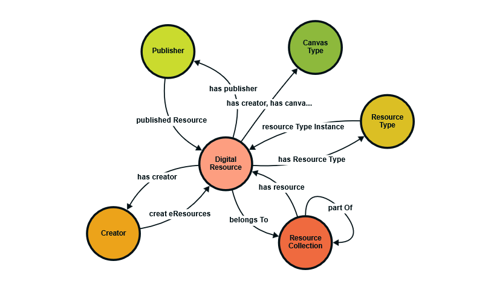

# IIIFCollection Project  

The IIIFCollection project is a dynamic catalog based on IIIF. It emphasizes several technical features:  

## Key Features  

- Machine Readability: The catalog is designed to be machine-readable and consumable.  
- IIIF Compatibility: It is fully compatible with IIIF standards.  
- Hierarchical Arrangement: Resources in the catalog are all IIIF Manifests accessible online and are arranged hierarchically.  
- Flexible Data Structures: The data structures of the resources in the collection are highly flexible and can be enriched with external data sources, including XML, JSON, and RDF Turtle files.  
- Controlled Vocabularies: It is associated with standard controlled vocabularies and knowledge sources like AAT, TGM, Schema.org, and Wikidata.  
- Human Usability: While the primary focus is on machine consumption, the catalog is also usable by humans via standard IIIF viewers like Mirador and OpenSeaDragon.  
- Public Accessibility: The catalog remains publicly accessible.  


## Accessing the catalog  
You can access the catalog using any standard IIIF Viewer including Standard Mirador 3.0 or free instances of the
<a href="https://iiif.biblissima.fr/mirador3/?iiif-content=https://raw.githubusercontent.com/MehranDHN/IIIFCollection/refs/heads/master/IIIFCollection/IIIF2Collection.json" target="_blank">Mirador in Biblissima</a>.

## Important Notes

I aim to keep the catalog healthy despite daily changes in its structure and contents. As it expands, I make necessary modifications for enrichment. The final goal is a machine-readable catalog to present statistics and analytical information. Some resources reference external sources via the "seeAlso" field, which needs parsing. It's crucial to associate resources with controlled vocabularies like Getty's AAT and TGN, and the Library of Congress's TGM and SH.

## Preparing KG 
Creating a Knowledge Graph from the IIIF Collection is straightforward. IIIF Collections and Manifests are in JSON-LD, but we used the Turtle format to implement a simple ontology for representation. The primary entities are ResourceCollection (IIIF Collection) and DigitalResource (IIIF Manifest), both represented by owl:Class.


```turtle
@prefix owl: <http://www.w3.org/2002/07/owl#> .
@prefix rdf: <http://www.w3.org/1999/02/22-rdf-syntax-ns#> .
@prefix rdfs: <http://www.w3.org/2000/01/rdf-schema#> .
@prefix so: <https://schema.org/> .
@prefix xsd: <http://www.w3.org/2001/XMLSchema#> .
@prefix : <http://example.com/mdhn/> .
@prefix aat: <https://vocab.getty.edu/aat/> .
@prefix wd: <https://www.wikidata.org/wiki/> .
@prefix dc: <http://purl.org/dc/elements/1.1/> .
@prefix dcterms: <http://purl.org/dc/terms/> .
@prefix mdhn: <http://example.com/mdhn/> .

mdhn:ResourceCollection a owl:Class ;
    rdfs:comment "A collection of IIIF resources that may contain manifests and nested collections." ;
    rdfs:label "Resource Collection" .

mdhn:DigitalResource a owl:Class ;
    rdfs:comment "A IIIF manifest representing a digital resource such as a book, photograph, or video." ;
    rdfs:label "Digital Resource" .

mdhn:Creator a owl:Class ;
    rdfs:comment "An entity responsible for creating the digital resource." ;
    rdfs:label "Creator" .

mdhn:ResourceType a owl:Class ;
    rdfs:comment "The content type of the digital resource, aligned with controlled vocabularies like AAT or TGM." ;
    rdfs:label "Resource Type" .

mdhn:Publisher a owl:Class ;
    rdfs:comment "An entity responsible for publishing or making the resource available." ;
    rdfs:label "Publisher" .

mdhn:CanvasType a owl:Class ;
    rdfs:comment "The type of canvas used within a IIIF manifest to represent a resource page or image." ;
    rdfs:label "Canvas Type" .

mdhn:hasResource a owl:ObjectProperty ;
    rdfs:comment "Links a ResourceCollection to a DigitalResource." ;
    rdfs:domain mdhn:ResourceCollection ;
    rdfs:label "has resource" ;
    rdfs:range mdhn:DigitalResource .

mdhn:hasCreator a owl:ObjectProperty ;
    rdfs:comment "Links a DigitalResource to its creator." ;
    rdfs:domain mdhn:DigitalResource ;
    rdfs:label "has creator" ;
    rdfs:range mdhn:Creator .

mdhn:hasCanvasType a owl:ObjectProperty ;
    rdfs:comment "Links a DigitalResource to its canvas type." , "Links a DigitalResource to its creator." ;
    rdfs:domain mdhn:DigitalResource ;
    rdfs:label "has canvas type" , "has creator" ;
    rdfs:range mdhn:CanvasType .

mdhn:hasResourceType a owl:ObjectProperty ;
    rdfs:comment "Associates a DigitalResource with its resource type." ;
    rdfs:domain mdhn:DigitalResource ;
    rdfs:label "has Resource Type" ;
    rdfs:range mdhn:ResourceType .

mdhn:hasPublisher a owl:ObjectProperty ;
    rdfs:comment "Links a DigitalResource to its publisher." ;
    rdfs:domain mdhn:DigitalResource ;
    rdfs:label "has publisher" ;
    rdfs:range mdhn:Publisher .

mdhn:hasUrl a owl:DatatypeProperty ;
    rdfs:comment "The URL of a ResourceCollection or DigitalResource." ;
    rdfs:domain [
        a owl:Class ;
        owl:unionOf ( mdhn:ResourceCollection mdhn:DigitalResource )
    ] ;
    rdfs:label "has URL" ;
    rdfs:range xsd:anyURI .

mdhn:caption a owl:DatatypeProperty ;
    rdfs:comment "A human-readable label for a resource or collection." ;
    rdfs:domain [
        a owl:Class ;
        owl:unionOf ( mdhn:ResourceCollection mdhn:DigitalResource )
    ] ;
    rdfs:label "label" ;
    rdfs:range xsd:string .


mdhn:belongsTo a owl:ObjectProperty ;
    rdfs:comment "Links a ResourceCollection to a DigitalResource." ;
    rdfs:domain mdhn:DigitalResource ;
    rdfs:label "belongs To" ;
    rdfs:range mdhn:ResourceCollection ;
    owl:inverseOf mdhn:hasResource .

mdhn:publishedResource a owl:ObjectProperty ;
    rdfs:comment "Links a publisher to DigitalResource." ;
    rdfs:domain mdhn:Publisher ;
    rdfs:label "published Resource" ;
    rdfs:range mdhn:DigitalResource ;
    owl:inverseOf mdhn:hasPublisher .

mdhn:createResources a owl:ObjectProperty ;
    rdfs:comment "Links a Creator to DigitalResource." ;
    rdfs:domain mdhn:Creator ;
    rdfs:label "creat eResources" ;
    rdfs:range mdhn:DigitalResource ;
    owl:inverseOf mdhn:hasCreator .

mdhn:resourceTypeInstance a owl:ObjectProperty ;
    rdfs:comment "Associates Resource Type to instances." ;
    rdfs:domain mdhn:ResourceType ;
    rdfs:label "resource Type Instance" ;
    rdfs:range mdhn:DigitalResource ;
    owl:inverseOf mdhn:hasResourceType .

mdhn:partOf a owl:ObjectProperty ;
    rdfs:comment "Links a ResourceCollection to it's parent" ;
    rdfs:domain mdhn:ResourceCollection ;
    rdfs:label "part Of" ;
    rdfs:range mdhn:ResourceCollection .
```

Graphical representation of this Ontology:

